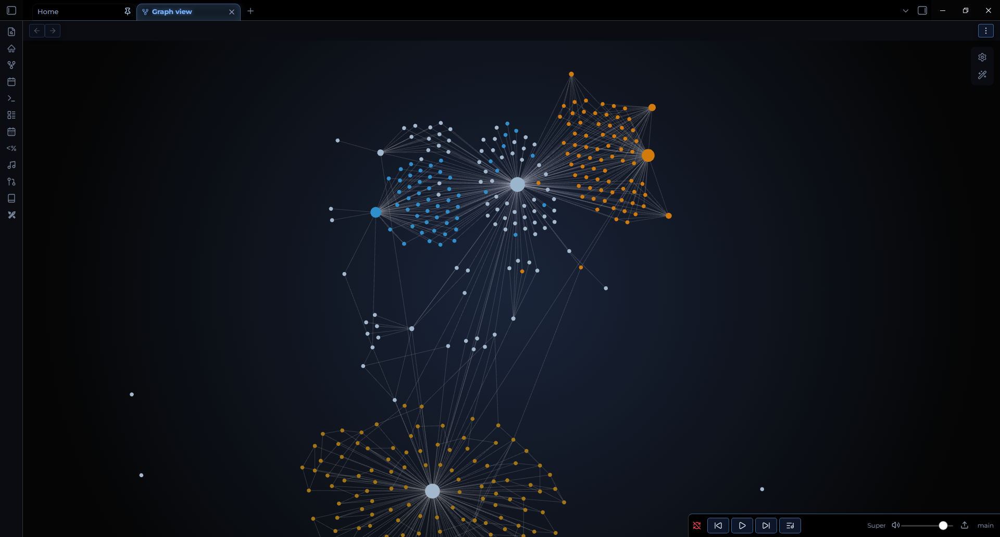

# 🌌 Nebulux for Obsidian
 
A premium dark, immersive, and neon theme that transforms your Obsidian into a true interstellar cruiser dashboard. Designed for focus, immersion, and complex data management.
 

 
## ✨ Key Features
 
* 🖥️ **Sci-Fi Cockpit:** Darkened interface, futuristic fonts, and neon glow effects for optimal contrast.
* 🔠 **Gradient Headers (H1-H6):** Dynamic headers with unique gradients (Stellar Glow, Neon Nav, Status Energy, etc.) to elegantly hierarchy your notes.
* 🌫️ **Glassmorphism:** Dynamic transparency and background blur on active tabs and floating menus.
* 📁 **Dynamic File Explorer:** Built-in "Rainbow Folders" effect to automatically colorize and visually differentiate your folders.
* ⚙️ **Highly Customizable:** Full support for the *Style Settings* plugin.
 
---
 
## 🚀 The 3 Pillars (Custom Callouts)
 
The theme features a custom callout system tailored to structure your dashboards, based on a strict design language. Use these to visually organize your data.
 
| Syntax | Render | Usage |
| :--- | :--- | :--- |
| `> [!nav]` | 🧭 **Neon Blue** | Navigation, Table of Contents, Dashboards. |
| `> [!status]` | 📊 **Tactical Gold** | Tasks, Validations, Project Status. |
| `> [!projects]`| 🚀 **Tactical Bronze**| Ideas, Ongoing projects, Warnings. |
 
### 🛠️ Icon Modifiers (Tactical Mode)
You can swap the default callout icon on the fly by adding a keyword after a slash `/`.
 
| Keyword | Icon | Example |
| :--- | :---: | :--- |
| `idea` | 💡 | `> [!projects/idea]` |
| `brain` | 🧠 | `> [!projects/brain]` |
| `bug` | 🐞 | `> [!status/bug]` |
| `target` | 🎯 | `> [!status/target]` |
| `write` | ✍️ | `> [!nav/write]` |
| `file` | 📂 | `> [!nav/file]` |
| `heart` | ❤️ | `> [!projects/heart]` |
 
### 🔲 Clean Mode
If you want a minimalist block (just the frame and color) without any icon on the left. Useful if you put an emoji directly in the title.
* **Syntax:** `> [!type/clean]` (e.g., `> [!nav/clean]`)
 
### 💠 Native Mode
If you want to use the default Obsidian vector icons (SVG) instead of the theme's emojis.
* **Syntax:** `> [!type/native]` (e.g., `> [!status/native]`)
 
*(Note: Default Obsidian callouts like `> [!info]` or `> [!warning]` are also supported and natively colorized to match the Nebulux palette).*
 
---
 
## 🎛️ Building Dashboards
 
Nebulux offers two powerful ways to build beautiful button grids and dashboards using Markdown lists inside callouts.
 
### Method 1: The Flexbox Menu (No frontmatter required)
Perfect for quick navigation bars at the top of your notes. It automatically wraps your links into sleek buttons.
**Syntax:** Use the `nav/menu` callout modifier.
 
```markdown
> [!nav/menu] Quick Links
> - [Home](Home)
> - [Projects](Projects)
> - [Resources](Resources)
```
 
### Method 2: The Classic Full-Page Dashboard Grid
Perfect for a dedicated "Homepage" or "MOC". This transforms a standard `> [!nav]` callout into a robust grid of square buttons.
 
**Step 1:** Add the `dashboard` cssclass to your note's frontmatter:
```yaml
---
cssclasses: dashboard
---
```
 
**Step 2:** Use the standard `> [!nav]` callout with a list:
```markdown
> [!nav] System Navigation
> - [Daily Note](Daily)
> - [Tasks](Tasks)
> - [Finances](Finances)
```
 
---
 
## 🔡 Typography & Offline Use
 
The theme uses **Orbitron** for headers and **Montserrat** for the body text to achieve its futuristic look. 
 
* **Online:** The fonts are automatically loaded via Google Fonts.
* **Offline:** To use the theme without an internet connection, please install the fonts on your OS:
  * [Download Montserrat](https://fonts.google.com/specimen/Montserrat)
  * [Download Orbitron](https://fonts.google.com/specimen/Orbitron)
 
---
 
## ⚙️ Installation & Configuration
 
1. Search for **Nebulux** in the Obsidian Community Themes gallery and click "Install".
2. In Obsidian, go to `Settings > Appearance` and select the theme.
3. **Important:** Install the **Style Settings** community plugin to unlock all theme options (Neon colors, header gradients, blur intensity, etc.).
 
*💡 Tip: To fully enjoy the Glassmorphism effect on the top bar, it is highly recommended to enable the "Hidden window frame" option in Obsidian's Appearance settings.*
 
---
*Created with ✨ by [Zoléni KOKOLO ZASSI (@Sikoso774)](https://github.com/Sikoso774)*