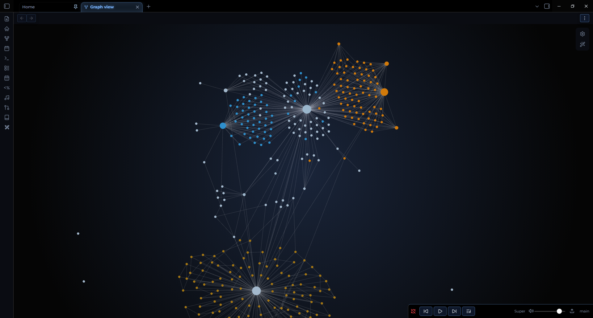

# 🌌 Nebulux for Obsidian

A dark, immersive, and neon theme that transforms your Obsidian into a true interstellar cruiser dashboard. Designed for focus, immersion, and complex data management.

## ✨ Key Features

* 🖥️ **Sci-Fi Cockpit:** Darkened interface, futuristic fonts (Orbitron & Montserrat), and neon glow effects for optimal contrast.
* 🔠 **Gradient Headers (H1-H6):** Dynamic headers with unique gradients (Stellar Glow, Neon Nav, Status Energy, etc.) to elegantly hierarchy your notes.
* 🌫️ **Glassmorphism:** Dynamic transparency and background blur on active tabs and floating menus.
* 📁 **Dynamic File Explorer:** Built-in "Rainbow Folders" effect to automatically colorize and visually differentiate your folders.
* ⚙️ **Highly Customizable:** Full support for the *Style Settings* plugin.

## 🚀 The 3 Pillars (Custom Callouts)

The theme features a custom callout system tailored to structure your dashboards, based on a strict design language:

| Syntax | Render | Usage |
| :--- | :--- | :--- |
| `> [!nav]` | 🧭 **Neon Blue** | Navigation, Table of Contents, Dashboards. |
| `> [!status]` | 📊 **Tactical Gold** | Tasks, Validations, Project Status. |
| `> [!projects]`| 🚀 **Project Bronze**| Ideas, Ongoing projects, Warnings. |

### 🛠️ Icon Modifiers
You can swap the default callout icon on the fly by adding a keyword after a slash `/` :
* `> [!projects/brain]` 🧠 (Brainstorming Session)
* `> [!status/bug]` 🐞 (Bug Report)
* `> [!nav/clean]` (Removes the icon entirely for a minimalist look)
* `> [!status/native]` (Forces the default Obsidian SVG icon)

## ⚙️ Installation & Configuration

1. Search for **Nebulux** in the Obsidian Community Themes gallery and click "Install".
2. In Obsidian, go to `Settings > Appearance` and select the theme.
3. **Important:** Install the **Style Settings** community plugin to unlock all theme options (Neon colors, header gradients, blur intensity, etc.).

*Note: To fully enjoy the Glassmorphism effect on the top bar, it is highly recommended to enable the "Hidden window frame" option in Obsidian's Appearance settings.*

---
*Created by [Zoléni KOKOLO ZASSI](https://github.com/Sikoso774)*